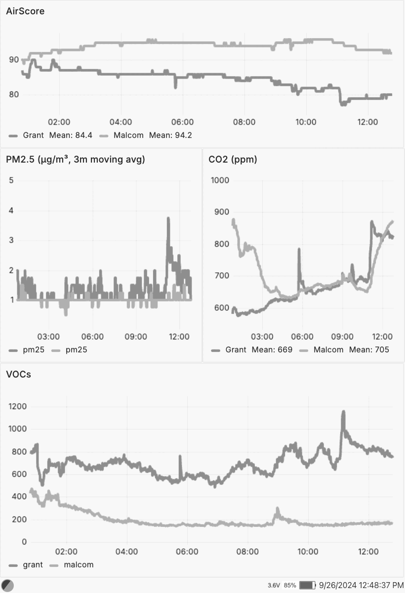

# eink-dashboard

Applications to support generating and hosting content for an `e-ink` dashboard.

Looking for the firmware? See [cdaringe/eink-dashboard-firmware](https://github.com/cdaringe/eink-dashboard-firmware).

Here's an example dashboard:

## usage

This project is largely meant to be _forked_, edited and run. Some of this may
be refactored to be more "librarified". Until then, here's the scoop:

### run

- (optional) install [rad](https://github.com/cdaringe/rad/?tab=readme-ov-file#install)
  (e.g.
  `curl -fsSL https://raw.githubusercontent.com/cdaringe/rad/main/assets/install.sh | sh`)
- `rad dockerRun`

### develop

Please see the docs in [apps/dashboard-host/readme.md](./apps/dashboard-host/readme.md)!
