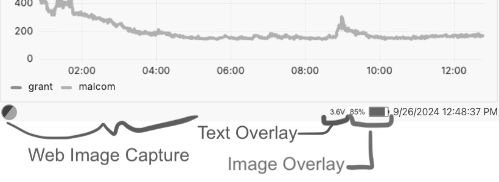

# dashboard-host

- serves e-ink display-ready images
- generates new e-ink friendly images on a user-specified interval by taking web
  screenshots
- serves a client-side only static webapp for grabbing screenshots. see the
  [web-dashboard](../web-dashboard/).
  - this feature is optional--you can use any URI
- applies image overlays (such as battery life) on top of web-scraped images

**@warning**: This server is insecure. Do not deploy this in untrusted
environments. Moderate amounts of unsanitized user-input is fed into shell
executions!

## usage

### run it

- Development: `pnpm run start`
- Production: See [the docker-compose.yml](../../docker-compose.yaml)!

## configure it

Please see the [config module](./src/lib/config.ts) for ENV vars you can use to
fine tune the workflow. You may also study the
[the docker-compose.yml](../../docker-compose.yaml) for references.

## api

When accessing the server to download images, you can add overlays!

Overlays are query-param driven.

| overlay          | interface                                                             | description                                               |
| ---------------- | --------------------------------------------------------------------- | --------------------------------------------------------- |
| battery          | [see battery overlay for usage details](.src/lib/overlays/battery.ts) | Add a battery icon with remaining battery % to the image. |
| text             | [see text overlay for usage details](./src/lib/overlays/text.ts)      | Add text onto the image.                                  |
| more-cool-stuff? | ???                                                                   | Let's add more together :)                                |

## architecture

1. The host process--in idle state--is a very thin server that serves:
   1. e-ink ready images over http
   2. an optional [../web-dashboard](../web-dashboard/) as the source of
      screenshotted e-ink images
2. On an interval, the host create a child process to capture new snapshots. The
   snapshot process has few major components, by default:
   1. An optional webapp. The webapp is developed in
      [../web-dashboard](../web-dashboard/), but at runtime, only compiled
      static assets are hosted and accessed by the snapshot script. This keeps
      runtime resources minimal, and ephemeral only to the snap duration.
   2. Browser screenshots. An embedded chrome instance via puppeteer is used to
      capture an image from the aforementioned webapp.
   3. `convert/magick` is used to process the images into e-ink ready grayscale.
